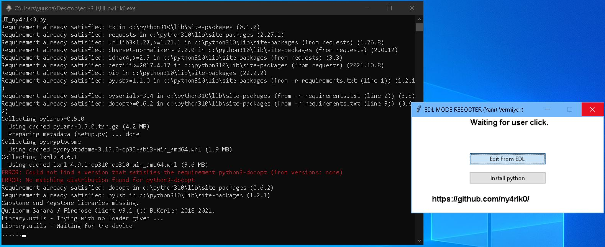

# EDL-Mode-Reboot
  <a href="https://github.com/ny4rlk0/EDL-Mode-Reboot/releases/download/MAIN/EDL_EXIT.exe">İndir / Download </a>
  1)"Drivers\Windows" içindeki tüm cihaz sürücülerini yükleyin.
  2)Libusb yazanda cihazınızı bağlayın. Seçip install butonuna basın.
  3)UI_ny4rlk0.exe uygulamasını açın.
  4)Install Python butonuna basıp 2-3 dk bekleyin. 
  (İnternet hızınıza bağlı 30 MB civarı indirme yapacak. Bu arada yazılım aceleyle yazdığım için donabilir kapatmayın. İndirip kursun Python'u.)
  5)Exit EDL butonuna basın.
  6)Sorun çıkarsa ekran alıntısını atın. (Komut satırının.)
  Ekran Görüntüsü
  

    
  Ben sadece arayüz yazıp yazılımı çalışır hale getirdim. Bütün kredi sahara'yı yazana aittir.
